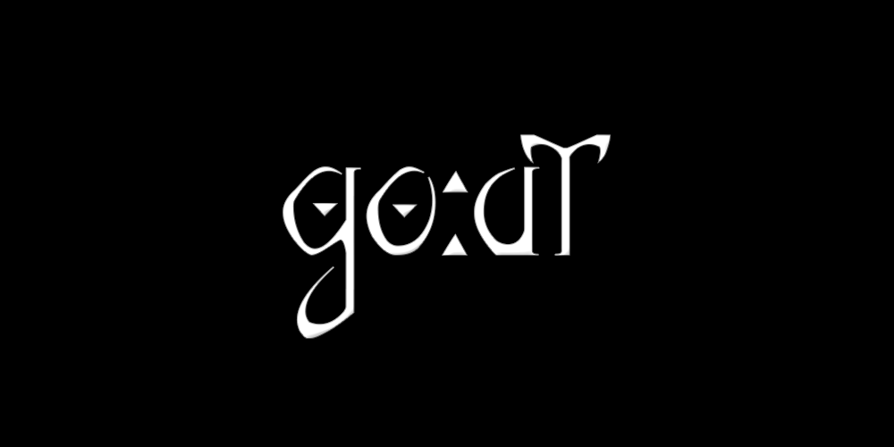

<h1>Web Projects</h1>

------------------------------------------------------------

<h2>SpaceSheep</h2>

SpaceSheep is a Space Shooter game made with Construct 2 where the main character is a Sheep that needs to save the space from enemies such as scissors, foxes and a big bad wolf. 

<a href="https://carlosantq.github.io/SpaceSheep/">Play It Here</a>

<h3>Developers</h3>

- Carlos Antônio
- Jeckson Victor
- Marcelo Barcellos

------------------------------------------------------------

<h2>GoAt</h2>

Beta of an endless runner game made with Construct 2.

<a href="https://carlosantq.github.io/GoAt/">Play it here</a>

<h3>Developers</h3>

- Carlos Antônio
- Jeckson Victor
- Marcelo Barcellos

------------------------------------------------------------

<h2>Cyclonic</h2>

This is a prototype for an application that would be responsible for selective collection of discarded materials in an apartment buildings context.

<a href="https://carlosantq.github.io/Cyclonic/">Visit here</a>

<h3>Developers</h3>

- Carlos Antônio
- Murilo Bento
- Vinícius Kleiton
